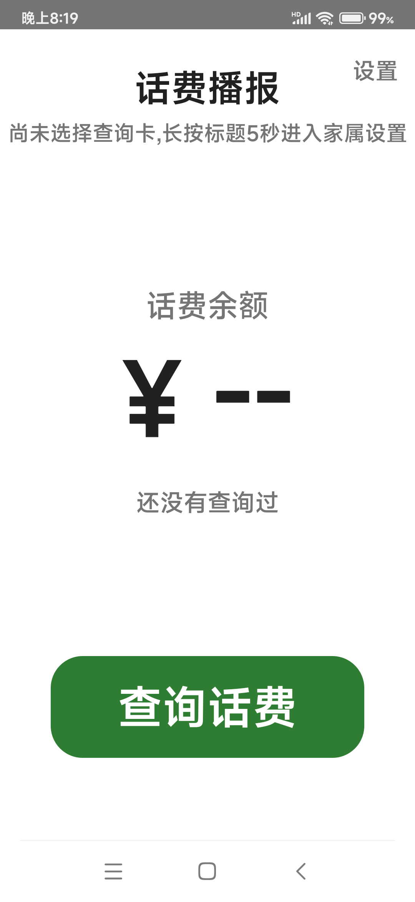
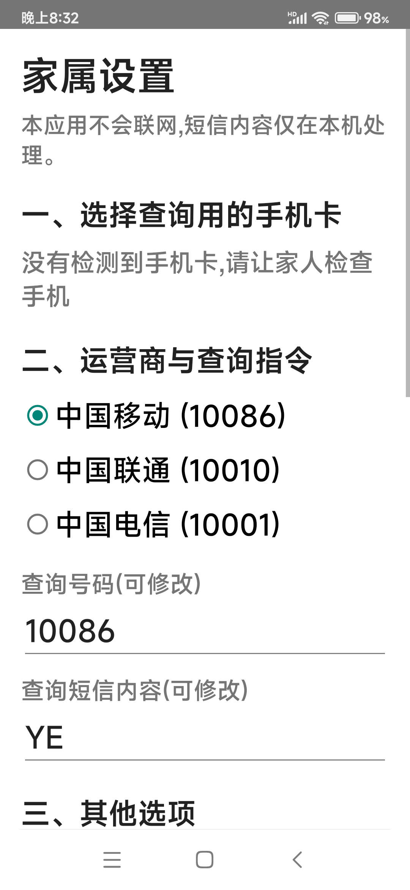

# 话费播报 HuafeiBroadcast

给老人查话费的安卓小工具：点一个大按钮，App 自动给运营商发查询短信，收到回复后自动解析余额，再用中文语音念出来。不用打字，不用记指令，也不用看小字菜单。

<p>
  
  
  
</p>

## 特点

- **一步查询**：主界面只有一个大按钮。开启「打开 App 自动查询」后，点桌面图标就直接开始查。
- **自然中文播报**：36.20 元念「三十六元二角」，36.05 元念「三十六元零五分」，不是机械地念数字。播报时媒体音量临时调大，念完自动还原。
- 不需要播报的家庭可在设置里整体关闭，关闭后只显示不朗读。
- **三大运营商内置**：中国移动（10086，发 YE）、中国联通（10010，发 102）、中国电信（10001，发 102）。各地指令有差异时，在设置页改号码和指令即可，不用改代码。
- **解析防误报**：运营商回复里常混着「本月消费」「套餐费」「剩余流量」等金额，解析器按关键词上下文挑出余额；挑不准就不播，宁可漏播不播错。
- **双卡安全**：查询短信只从设定的卡发出。卡槽变更后按 ICCID 重新匹配，匹配不上会提示重新设置，不会用另一张卡误发。
- **检查更新**：家属设置里可手动检查 GitHub 上的新版本，有更新时一键跳转浏览器下载。
- **轻量、不驻留**：体积小巧，无第三方 SDK，无常驻服务，查询结束即安静。

## 隐私

App 平时零联网，没有服务器、统计和广告，短信内容只在本机处理，除家属主动开启调试模式外不留存原始短信。唯一的联网行为是家属在设置页手动点「检查更新」时向 GitHub 查询最新版本号，不上传任何数据，下载通过系统浏览器完成。

| 权限 | 用途 |
|---|---|
| SEND_SMS | 向运营商号码发送查询短信 |
| RECEIVE_SMS | 接收运营商回复，仅处理查询后 60 秒内、发送号码在白名单内的短信；10 分钟内迟到的回复走宽限补显示 |
| READ_PHONE_STATE | 读取 SIM 卡列表，用于双卡选择 |
| VIBRATE | 按键震动反馈 |
| INTERNET | 仅在手动点「检查更新」时访问 GitHub，其余场景不联网 |

## 下载与安装

1. 从 [Releases](../../releases) 下载 `话费播报-release.apk` 传到手机安装（`-debug` 版日志更全，日常使用装 release 版）。
2. 打开 App，按「首次使用」引导操作：点「一键授权」，把系统弹出的短信、电话权限全部允许，页面会逐项显示授权状态。
3. 选择运营商后点「完成，开始使用」；双卡手机在引导页选卡，单卡自动完成。

### 小米 / 红米手机（MIUI / HyperOS）

- **放行系统权限**：App 右上角设置 → 小米权限设置，把**短信、通知类短信、电话**设为允许（不需要自启动）。系统安全层不放行时（日志表现为 `MIUILOG- Sms Filter`），短信广播不会送达本应用，收不到运营商回复。覆盖安装或清除数据后若复发，重新放行一次即可。
- **USB 安装**：「仅限充电」模式下 MIUI 拒绝 adb 安装，请切到「传输文件」；在手机上直接用文件管理器点 APK 安装则无此限制。

## 使用说明

- 按大按钮开始查询，一般十几秒收到回复并语音播报；60 秒未收到会语音提示。运营商对频繁查询限流，遇到就等几分钟再查。
- 没听清，点一下余额数字重新播报。
- 点右上角设置按钮进入家属设置，里面有 SIM 卡、运营商、指令、自动查询、语音播报开关、语速、震动、检查更新、短信解析测试、调试模式等选项。

## 已知限制

1. MIUI / HyperOS 机型每次覆盖安装或清除数据后，可能需要重新放行一次短信权限。
2. MIUI 不向第三方应用返回完整订阅列表，双卡时自动改用系统「默认短信卡」发送——请在系统设置里把默认短信卡设为查话费的那张。
3. 播报依赖系统中文 TTS（小米自带离线引擎的默认音色即小爱同学）。换机后若没有中文引擎，设置页会提示。
4. 运营商回复格式怪异的地方性短信可能解析不出，可在设置页用「模拟短信」调试关键词。

## 从源码构建

需要 JDK 17+ 与 Android SDK（API 34）。Windows 下请把工程放在纯英文路径（AGP 的限制，中文路径下单元测试无法运行）。

```bash
git clone https://github.com/xiaoxiao602/HuafeiBroadcast.git
cd HuafeiBroadcast
gradlew :app:assembleDebug      # 调试包
gradlew :app:assembleRelease    # 正式包（无签名密钥时产出未签名包）
gradlew :app:testDebugUnitTest  # 单元测试
```

Release 签名：把 `huafei-release.jks` 放到项目根目录，并在 `gradle.properties`（项目或 `~/.gradle` 均可）配置：

```properties
huafei.storePassword=你的store密码
huafei.keyPassword=你的key密码
# huafei.keyAlias=huafei  # 默认即 huafei
```

密钥不随仓库分发（`.gitignore` 已排除 `*.jks`）。更新版 APK 必须用同一密钥签名，否则无法覆盖安装。

## 架构

```
com.family.huafei
├─ MainActivity        老人主界面（余额、本月消费、大按钮、设置入口）
├─ SetupActivity       首次使用引导（授权 + 选运营商，小米机型引导放行「通知类短信」）
├─ SettingsActivity    家属设置（SIM、运营商、指令、自动查询、播报开关、语速、震动、检查更新、解析测试、调试）
├─ BalanceReceiver     短信接收器，Manifest 静态注册，进程不在也会被系统唤醒
├─ QueryResultHandler  结果处理：前台由 Activity 播报，后台由 BgTts 临时绑定、播完即关
├─ SmsSenderMatcher    发送方白名单匹配（10086、+86 前缀、106 端口）
├─ BalanceParser       关键词上下文评分解析，三运营商专属 Parser + Fallback 兜底
├─ MoneyFormatter      金额转自然中文读法
├─ CarrierProfile      运营商配置（号码、指令、白名单、解析器，家属可改）
├─ Prefs               SharedPreferences 持久化
├─ QueryState          状态机 IDLE→SENDING→WAITING→SUCCESS/FAILED→IDLE
├─ TtsManager          系统 TTS 封装，中文、离线优先
├─ TtsVolumeBoost      播报期间媒体音量临时 80%，播完还原
├─ UpdateChecker       手动检查 GitHub 最新版本，跳转浏览器下载
├─ PermissionHelper    运行时权限状态汇总，引导页逐项显示授权进度
├─ TimeoutReceiver     查询超时闹钟兜底，进程被杀也按时提示
├─ SmsSimulator        模拟收到余额短信，调试解析与后台播报
└─ VibrateHelper       震动反馈
```

几个关键设计：

- 状态机持久化在 SharedPreferences，进程被杀重启后可恢复，超时任务在 onResume 重新调度。
- SIM 匹配链：保存的 subId → ICCID 重匹配 → 唯一卡自动选 → 默认短信卡兜底，卡失效时不会误发另一张卡。
- 只解析「等待窗口内 + 白名单号码」的短信；60 秒超时后、10 分钟内到达的回复走迟到宽限，界面可见时补播报，不可见时静默更新。
- 解析防呆：金额必须紧邻余额类关键词，干扰词更靠近金额时直接拒绝，多个金额得分并列时宁可不播。

完整产品设计见 [docs/需求文档.md](docs/需求文档.md)。

## 测试

单元测试 37 项全部通过：MoneyFormatter 覆盖整数、小数、角分、零、万位等全部格式；BalanceParser 覆盖三运营商真实短信、干扰案例（同短信含消费、套餐、流量金额时只取余额）和白名单匹配；UpdateChecker 覆盖版本号比较。

真机验证：

- **Redmi 9**（MIUI 13 / Android 12，中国移动）：发送 YE 到 10086，9 秒收到回复，解析出 24.89 元并正确跳过同短信中的「本月产生话费16.00元」，播报、后台播报、音量还原、超时提示、进程被杀恢复均通过；`dumpsys activity services` 确认无常驻服务。
- **小米 15 Ultra**（HyperOS 4）、**Redmi K70**（HyperOS 3 / Android 16）、**荣耀 V20**（PCT-AL10，HarmonyOS 4 / Android 10 底座）：侧载安装，放行权限后全链路查询与语音播报正常。

各版本功能变化见 [CHANGELOG.md](CHANGELOG.md)。

## License

[MIT](LICENSE) · 作者：萧萧（[@xiaoxiao602](https://github.com/xiaoxiao602)）
